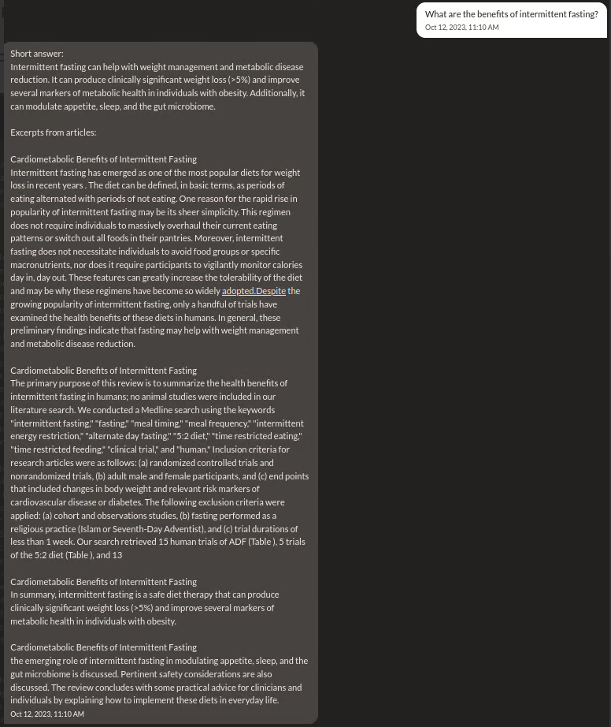

# ScienceStr
Nostr bot that answers scientific questions by accessing decentralized repositories of available research papers and constructs and answer with the help of large language models.

## How 
Combining [nostr](https://nostr.net) with [standard template construct](https://github.com/nexus-stc/stc) which hosts vast amount of academic research and other content on ipfs.

## Roadmap:
- PoC with OpenAI
- Poc with self-hosted LLM
- Add links to sources in replies
- Package in a simply deployable way

## Demo

## How to run
tbd
